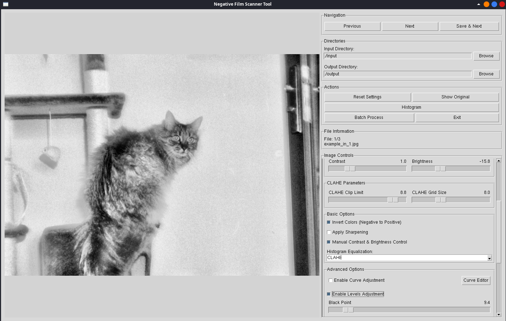

# Negative Film Scanner Tool

An advanced tool for black and white film scanning, cropping, and enhancement with a simple, intuitive user interface.

## License

This project is licensed under the MIT License - see the [LICENSE](LICENSE) file for details.

## Features

- Tkinter-based user interface
- Integrated image preview
- Histogram analysis
- Enhanced image processing algorithms
- File browser for selecting input/output directories
- Toggle between original and processed images
- Batch processing capability for multiple images
- Noise reduction with adjustable strength
- Multiple sharpening methods (standard, unsharp mask, high pass)
- Adaptive histogram equalization (CLAHE) with customizable parameters
- Advanced tone curve editor for precise tonal adjustments
- Levels adjustment (black point, white point, gamma)

## Usage

1. Install requirements:
   ```
   pip install -r requirements.txt
   ```

2. Run the application:
   ```
   python main.py
   ```

3. Use the interface:
   - Select an input directory using the "Browse" button
   - Adjust settings using the sliders and controls
   - Navigate between images with the Previous/Next buttons
   - Click "Save & Next" to save the current image and move to the next
   - Click "Show Original" to toggle between original and processed views
   - Use "Reset Settings" to restore default values
   - Click "Histogram" to view the image histogram
   - Use "Batch Process" to apply current settings to all images in the input directory

4. Output photos are stored in the selected output directory

## Controls

### Navigation
- **Previous**: Move to the previous image
- **Next**: Skip to the next image without saving
- **Save & Next**: Save the current image and move to the next

### Basic Image Adjustments
- **Rotation**: Rotate the image ±50 degrees
- **Crop Controls**: Adjust the crop area width, height, and position
- **Sharpness**: Control the amount of sharpening applied
- **Contrast**: Logarithmic control for better contrast adjustment
- **Brightness**: Adjust image brightness
- **Denoise**: Reduce noise in the image
- **CLAHE Parameters**: Fine-tune the adaptive histogram equalization

### Basic Options
- **Invert Colors**: Convert negative to positive
- **Apply Sharpening**: Toggle sharpening on/off
- **Manual Contrast & Brightness**: Enable manual contrast/brightness controls
- **Histogram Equalization**: Choose between None, CLAHE, or Standard equalization

### Advanced Options
- **Curve Adjustment**: Access the curve editor for precise tonal control
- **Levels Adjustment**: Adjust black point, white point, and gamma
- **Unsharp Mask**: Fine-tune sharpening with radius, amount, and threshold controls
- **High Pass Filter**: Enhance details with adjustable radius
# examples
### GUI on Linux (tkinter):


### example inputs:


### example outputs:


