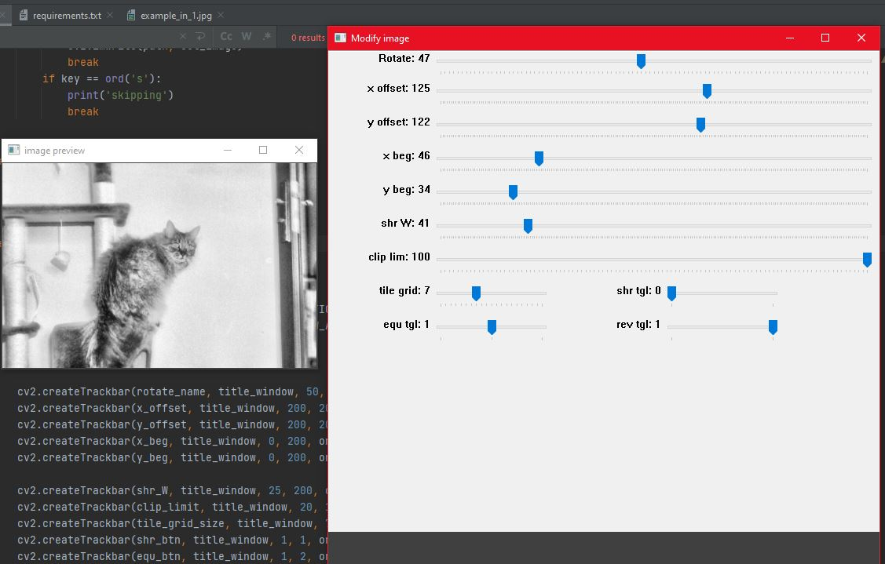
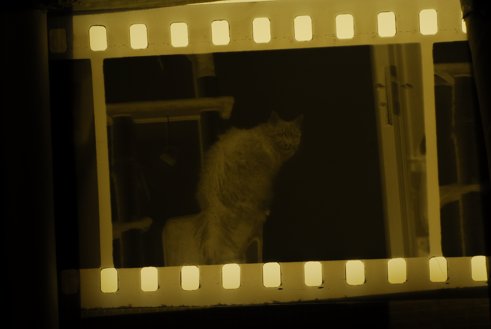
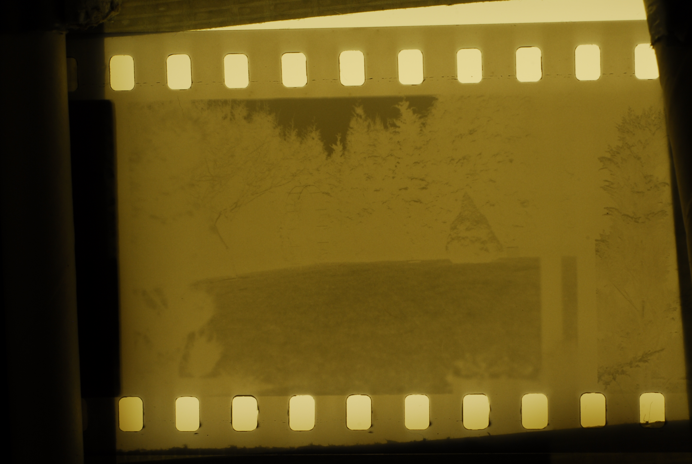
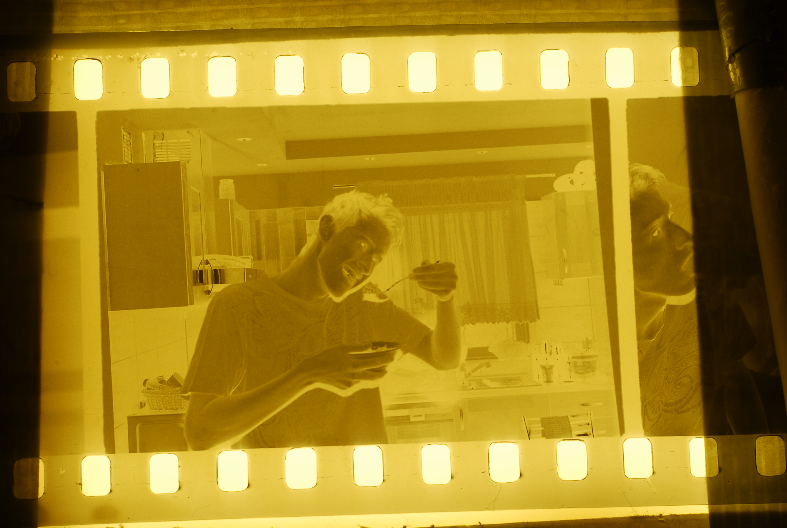
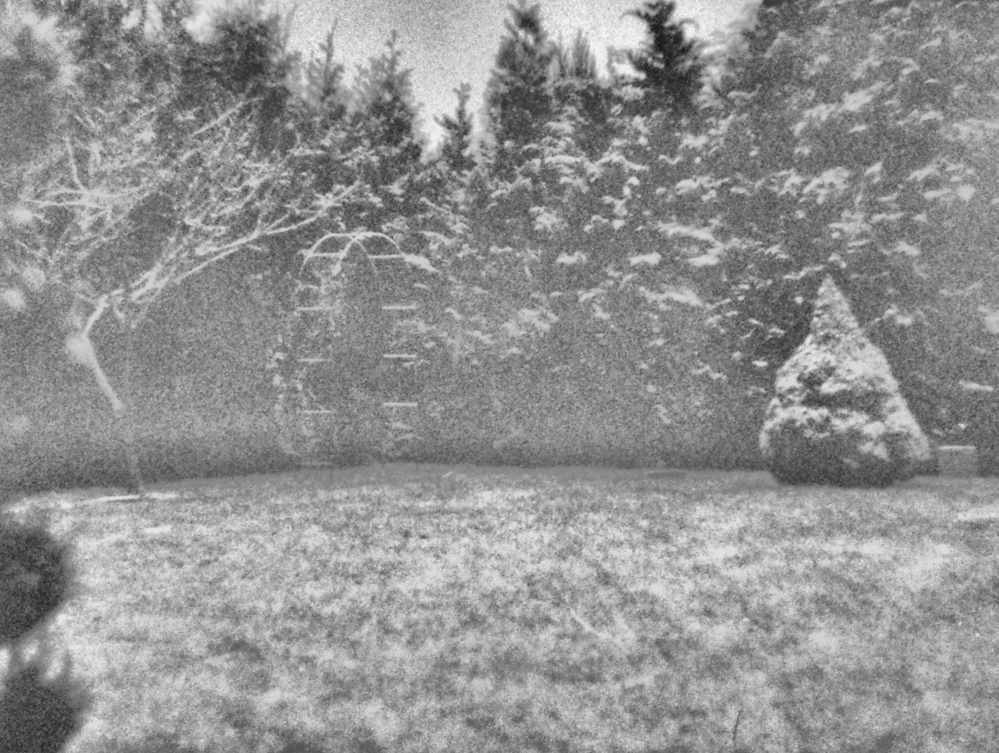
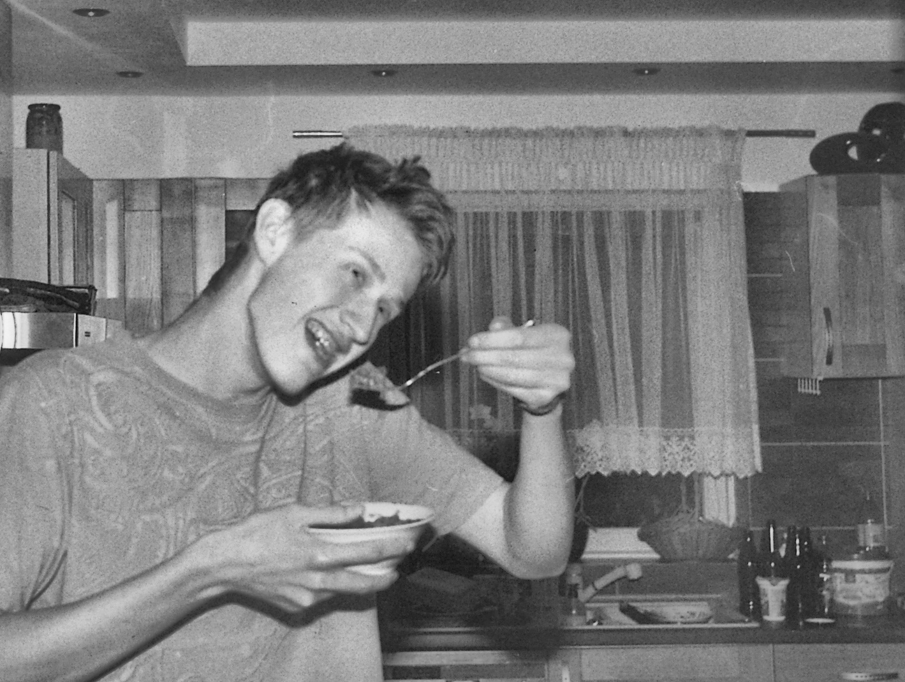

# negative-film-scanner-tool
Simple tool for yet only BW film scanning, cropping and enhancement.
# usage
- Install requirements
- Put scanned photos in the ./input directory
- Run script main.py
- Adjust settings
- Press 'q' on your keyboard to go to the next photo or 's' to skip
- Output photos are stored in the ./output directory.
# examples (distorted images)
### example of proper alignment:

### example inputs:

### example outputs:

